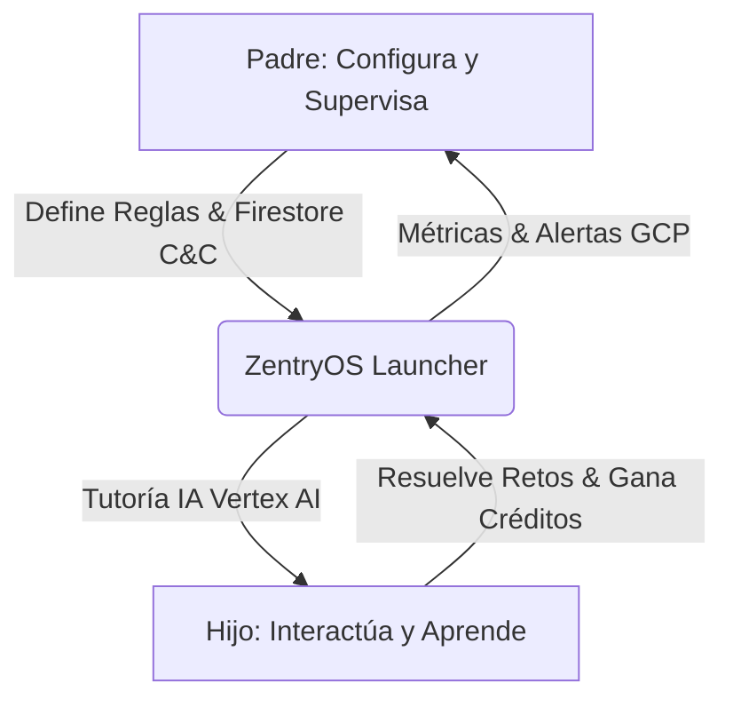

# ⚖️ La Solución Bilateral

El fracaso de la mayoría de las soluciones de control parental tradicionales radica en que son **unilaterales**: benefician exclusivamente al padre mediante la imposición, lo que genera rechazo y rebeldía en el menor. ZentryOS se concibe bajo una estructura de **propuesta de valor bilateral**.

---

## 👨‍👩‍👧‍👦 Dinámica de la Propuesta Bilateral

---

## 🛡️ Vertical del Padre: Paz Mental, Seguridad y Telemetría

Para el tutor legal, ZentryOS es una herramienta de gobernanza del dispositivo móvil que garantiza que la tecnología actúe como un aliado de crianza y no como una fuente de conflicto.

### Características Clave:
*   **Consola de Mando Remoto (Kill-Switch)**: Utilizando Firebase Firestore en tiempo real, el padre puede bloquear instantáneamente el dispositivo con un solo toque desde su propio teléfono, sin importar dónde se encuentre el niño.
*   **Filtro de Contenido Dinámico**: Gestión de listas blancas de URLs y aplicaciones autorizadas para el estudio y ocio regulado.
*   **Reportes de Telemetría Cognitiva**: Informes semanales generados por IA a partir de las interacciones del niño con el tutor virtual. El padre no recibe un historial crudo de navegación (que vulnera la privacidad), sino un resumen estructurado:
    *   *Temas de interés detectados (ej: astronomía, dinosaurios).*
    *   *Nivel de comprensión lógica e idiomas.*
    *   *Estado de ánimo y posibles patrones de ansiedad.*

---

## 🚀 Vertical del Menor: Gamificación, Libertad Regulada y Tutoría IA

Para el niño o adolescente, ZentryOS no se presenta como un bloqueo, sino como un **portal interactivo personalizado (un "sistema de juego")** donde es el protagonista de su aprendizaje.

### Características Clave:
*   **El Tutor Zentry**: Un avatar de Inteligencia Artificial que no juzga ni califica, sino que conversa, responde preguntas existenciales, ayuda con las tareas escolares y cuenta historias personalizadas según las preferencias del menor.
*   **Economía de Créditos**: Un sistema transparente de recompensa. El tiempo de uso libre en Internet o videojuegos no se otorga por defecto; se "gana" completando retos de matemáticas, lectura o idiomas. Esto empodera al menor enseñándole el valor del esfuerzo y la autogestión del tiempo.
*   **Personalización Estética**: Posibilidad de desbloquear temas visuales, avatares y elementos decorativos mediante el progreso educativo en la app.
*   **Modo Compañero**: La interfaz para jóvenes de 12 a 20 años cambia su estética "infantil" hacia un panel de productividad estilo *cyberpunk* o minimalista, actuando como un asistente de enfoque (*Focus Mode*) y gestión del tiempo de estudio.
