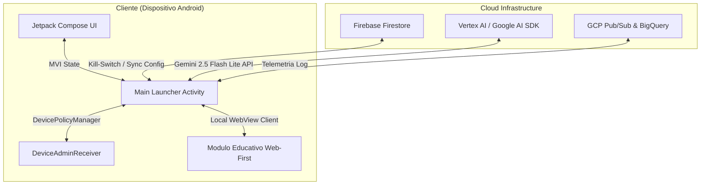

# 💻 Vertical 2: Arquitectura Técnica MVP

Esta sección describe los cimientos tecnológicos, patrones de diseño de software e integración de servicios cloud que conforman el ecosistema técnico de **ZentryOS**. 

---

## 📂 Contenido del Módulo

1.  **[Paradigma Web-First](./paradigma-web-first.md)**: El uso estratégico de WebViews optimizadas y Progressive Web Apps (PWAs) para acelerar el desarrollo de módulos educativos e interfaces secundarias.
2.  **[Control del Dispositivo & ABM](./control-dispositivo-abm.md)**: Implementación de privilegios de administrador de dispositivo (*Device Owner*), integración Android Enterprise y escalabilidad hacia iOS (Apple Business Manager).
3.  **[Telemetría y GCP/Vertex AI](./telemetria-gcp-ai.md)**: Conectividad con la API de IA Generativa de Google, canalización de logs a Google Cloud Platform y persistencia del Kill-Switch en Firebase Firestore.
4.  **[Interfaz Compose](./interfaz-compose.md)**: Estructuración visual en Android Nativo con Jetpack Compose, flujo MVI de estados y animaciones de nivel premium.
5.  **[Análisis de Brechas (Gap Analysis)](./analisis-de-brechas.md)**: Detalle del plan para evolucionar del prototipo funcional actual (5%) hacia un sistema operativo de seguridad robusto a nivel de kernel e infraestructura (100%).

---

## 🛠️ Stack Tecnológico Oficial (MVP)

### Componentes de Software:
*   **Lenguaje Primario**: Kotlin (Corrutinas y Flow para concurrencia reactiva).
*   **Seguridad y MDM**: APIs de `DevicePolicyManager` para restricción de sistema.
*   **Comando y Control (C&C)**: Firebase Firestore para escucha remota en tiempo real.
*   **Inteligencia Artificial**: Google Generative AI Client SDK (`generativeai:0.9.0`), empleando `gemini-2.5-flash-lite` para respuestas rápidas y rentables de texto y análisis multimodal.

---

## 🎨 Lineamientos de Diseño (Contexto Breve)

Para asegurar la consistencia estética en todas las iniciativas de ZentryOS, el diseño visual debe respetar estrictamente las siguientes pautas:

*   **Paleta Cromática Oficial**:
    *   **Púrpura Zentry (`#533B87`)**: Identidad de marca, toggles y títulos principales.
    *   **Lavanda Zentry (`#D6C8FA`)**: Fondo de botones primarios ("Get Started") e interactividad.
    *   **Verde Menta (`#C2F4E7`)**: Progreso, éxitos y estados activos.
    *   **Blanco Glacial (`#EBF1F5`)**: Base de fondo y contenedores translúcidos (glassmorphism).
    *   **Gris Neutro Oscuro (`#4A5160`)**: Texto principal, subtítulos y legibilidad general.
*   **Enfoque Visual**:
    *   **NO es una Dark Tech UI**: El fondo debe ser claro (Blanco Glacial) con marmoleados y degradados suaves de lila (Lavanda) y verde (Verde Menta). Se deben evitar creativos oscuros o diseños fuera de la línea visual.
    *   **Efecto Cristal (Glassmorphism)**: Tarjetas flotantes y paneles con fondo translúcido (`rgba(255, 255, 255, 0.4)`), bordes sutiles y desenfoque (`blur(25px)`).
*   **Tipografía**:
    *   **Outfit**: Para títulos y elementos destacados.
    *   **Inter**: Para cuerpo de lectura y textos explicativos.
