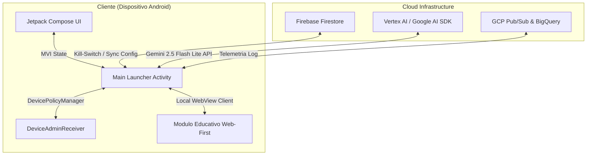

# 💻 Vertical 2: Arquitectura Técnica MVP

Esta sección describe los cimientos tecnológicos, patrones de diseño de software e integración de servicios cloud que conforman el ecosistema técnico de **ZentryOS**. 

---

## 📂 Contenido del Módulo

1.  **[Paradigma Web-First](file:///C:/Users/jange/.gemini/antigravity/scratch/zentryos-ssot/02-arquitectura-tecnica/paradigma-web-first.md)**: El uso estratégico de WebViews optimizadas y Progressive Web Apps (PWAs) para acelerar el desarrollo de módulos educativos e interfaces secundarias.
2.  **[Control del Dispositivo & ABM](file:///C:/Users/jange/.gemini/antigravity/scratch/zentryos-ssot/02-arquitectura-tecnica/control-dispositivo-abm.md)**: Implementación de privilegios de administrador de dispositivo (*Device Owner*), integración Android Enterprise y escalabilidad hacia iOS (Apple Business Manager).
3.  **[Telemetría y GCP/Vertex AI](file:///C:/Users/jange/.gemini/antigravity/scratch/zentryos-ssot/02-arquitectura-tecnica/telemetria-gcp-ai.md)**: Conectividad con la API de IA Generativa de Google, canalización de logs a Google Cloud Platform y persistencia del Kill-Switch en Firebase Firestore.
4.  **[Interfaz Compose](file:///C:/Users/jange/.gemini/antigravity/scratch/zentryos-ssot/02-arquitectura-tecnica/interfaz-compose.md)**: Estructuración visual en Android Nativo con Jetpack Compose, flujo MVI de estados y animaciones de nivel premium.
5.  **[Análisis de Brechas (Gap Analysis)](file:///C:/Users/jange/.gemini/antigravity/scratch/zentryos-ssot/02-arquitectura-tecnica/analisis-de-brechas.md)**: Detalle del plan para evolucionar del prototipo funcional actual (5%) hacia un sistema operativo de seguridad robusto a nivel de kernel e infraestructura (100%).

---

## 🛠️ Stack Tecnológico Oficial (MVP)

### Componentes de Software:
*   **Lenguaje Primario**: Kotlin (Corrutinas y Flow para concurrencia reactiva).
*   **Seguridad y MDM**: APIs de `DevicePolicyManager` para restricción de sistema.
*   **Comando y Control (C&C)**: Firebase Firestore para escucha remota en tiempo real.
*   **Inteligencia Artificial**: Google Generative AI Client SDK (`generativeai:0.9.0`), empleando `gemini-2.5-flash-lite` para respuestas rápidas y rentables de texto y análisis multimodal.
