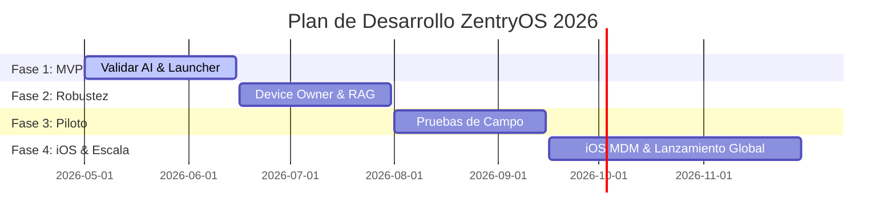

# 📅 Roadmap del Producto ZentryOS

Este documento establece el cronograma de desarrollo técnico y comercial para ZentryOS, dividiendo la ejecución en cuatro fases críticas con deadlines inamovibles.

---

## 🗺️ Cronograma General de Fases

---

## 🔍 Detalle de Fases y Deadlines

### 🚀 Fase 1: Validación del Core MVP (Estado Actual)
*   **Hito**: Demostración funcional básica de conectividad con Gemini 2.5 Flash y control de UI básico.
*   **Entregables**:
    *   APK inicial funcional con Jetpack Compose.
    *   Tutor socrático integrado vía Google AI SDK.
    *   Kill-Switch básico con Firebase Firestore.
*   **Deadline**: **15 de Junio de 2026** (Cumplido en un 95% a nivel de prototipo técnico).

### 🔒 Fase 2: Seguridad Industrial y Memoria AI (Nivel de Producción)
*   **Hito**: Bloqueo absoluto del dispositivo y tutor con memoria semántica del menor.
*   **Entregables**:
    *   Aprovisionamiento automático vía código QR (Android Enterprise).
    *   Deshabilitación total de la barra de estado y menús de sistema (Device Owner).
    *   Base de datos vectorial local (ObjectBox) para almacenamiento de memoria socrática (RAG).
    *   Detección de patrones de elusión mediante telemetría local.
*   **Deadline**: **31 de Julio de 2026**.

### 🧪 Fase 3: Piloto Comercial y Campaña de Adquisición
*   **Hito**: Validación de la propuesta bilateral con 100 familias y despliegue del DemoBook.
*   **Entregables**:
    *   Lanzamiento del Lead Magnet interactivo digital (Quiz de adicción digital).
    *   Formación del equipo de asesores de venta con el DemoBook.
    *   Prueba piloto cerrada: Medición de KPIs de engagement del menor (resolución de retos) y deserción parental.
    *   Sincronización automatizada de leads en Odoo CRM.
*   **Deadline**: **15 de Septiembre de 2026**.

### 🌍 Fase 4: Escalabilidad Multiplataforma y Lanzamiento
*   **Hito**: Lanzamiento oficial en Google Play Store e integración con Apple Business Manager (ABM).
*   **Entregables**:
    *   Consola MDM de ZentryOS en producción en GCP.
    *   Integración del perfil de configuración ineliminable para iOS (iPhones supervisados).
    *   Lanzamiento de la app complementaria nativa para padres.
    *   Apertura de pasarela de pago y suscripciones recurrentes anuales/mensuales.
*   **Deadline**: **30 de Noviembre de 2026**.
